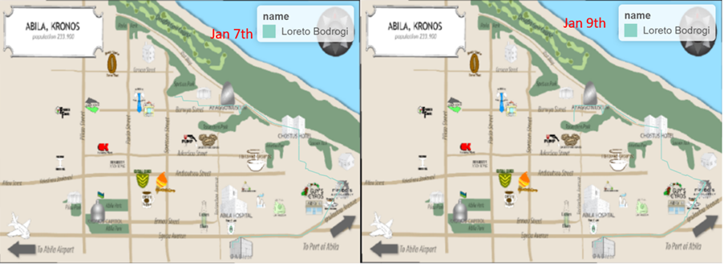

# INTRODUCTION 

As part of the VAST 2021 data visualization challenge. The task given was a scenario set in the fictional region of Kronos, where the natural gas production company GAStech has operated in the region for roughly 20 years. While the company has been successful throughout the period, some citizens of Kronos believe that their operations has not been responsible environmentally, most notably the group Protectors of Kronos (PoK). This culminates up to the current year where GAStech has successfully launched their IPO. However, some employees have been missing with PoK being suspected behind the scenes. 

As data visualization experts, we were called by the authorities of Kronos and Thetys, the region where GAStech originated, to help visualize the events happening and find anything in the data that may help understand more about the missing employees.

# MOTIVATION OF THE APPLICATION

Based on the given tasks, the main outline of this project can be listed as follow: 1) Identify the most popular locations frequented by the missing employees and collect insights using the historical data. In addition, anomalies are to also be noted and attempted to be explained. 2) Analyse the anomalies with the addition of location data of the assigned company vehicles and note the discrepancies present. 3) Match the employees with their credit cards, and subsequently, their purchasing and travelling behaviour. 4) Identify both formal and informal relationships between the employees. 5) Identify any suspicious activities occurring between the employees.

Hence, this project aims to develop an interface which is concise, interactive, and user-friendly using R Shiny to help the user explore the given dataset and answer the stated objectives.

# REVIEW AND CRITIC ON PAST WORKS

The same dataset had been used in 2014 VAST Challenge, which is listed in the Reference section. Some groups used heatmaps to show the relationship of location, date, time etc. City University London created their own map by using the Abila Road network. Central South University used heatmaps to show the transactions. All these methods are worth to refer. Hence, in the report, we mainly use a heatmap and bipartite graph to solve the 1st objective.  Also, the submission conducted by Kevin Griffin of University of California, Davis was chosen as a good foundation on how to move forward for the second objective. What Griffin did was he analysed the movements of each employee and connect the dots to find meaningful insights relevant to the questions asked. This method would especially be viable considering R shiny offers a dynamic filtering of data which could then be plotted. From the movement patterns, insights can also be obtained to how the employees’ relationships are with each other, relating to the 4th and 5th objectives. While not discussed in the 2014 papers, the acquired information could then be built upon by incorporating a network graph to fully answer the objective.

As for the 3rd objective, the submission’s answer to how the author solved data inconsistencies can be used. The author decided to match the movements of employees with purchase data based on the time similarities. Such a way can also be done to answer this objective.

# DESIGN FRAMEWORK

## Data

The data we used is from the VAST 2021.The typical data analysis workflow process of data preparation, data visualization, insights discovery, Shiny architecture and build the Shiny application. The application includes visual analysis methods and geo-spatial analytical methods to uncover the anomalies we found.

## Shiny Architecture

The Shiny application was built by using a free and opensource software ---- R language. The method selected refers to the papers from City University London, Central South University as well as the submission conducted by Kevin Griffin of University of California, Davis. We used Shiny to webify our results and providing options and visualisations for interactivity. It consists of 4 major views: Home page (Abstract and Introduction), Exploratory Data Analysis, Geospatial Analysis and Data frame (shows the owner of each card), and 6 components (Bar charts, heatmap, boxplot, bipartite graph, map and data table) were used to visualize the results.

## Analysis technology

### Bar Chart

The bar chart shows the popularity of each location by the number of times people visit it. The locations were separated into 5 categories (Business, Dining, Living, Unknown and NA) to give further meaning to what and why a location is the most popular. In addition, users can click “Show the data” on the sidebar to see details or just put their mouse on the bar as the chart is interactive.

### Heatmap

There are 3 types of heatmaps which shows the popularity of the locations by day, hour and people. An interactive sidebar with radio button is provided on the left for users to put in their input.

### Boxplot

To explore the insights about transactions, boxplots were chosen as the preferred option, which graphically depicts groups of numerical data through their quartiles. Box plots may also have lines extending from the boxes (whiskers) indicating variability outside the upper and lower quartiles, in this case, these outliers would help to identify the more suspicious transactions.

### Bipartite graph

When modelling relations between two different classes of objects, bipartite graphs very often arise naturally. Hence, a bipartite graph is used to check whether there is a cross use between credit cards and loyalty cards.

### Map

The fifth visual component, which is also the topmost of the application, is the map. This map is used extensively to uncover all suspicious relationships and movements. In this view, movements data records will be represented as routes in which users can input a desired timeframe as well as employees to track.

# CASE STUDY

## Most popular Location in Kronos

When analysing the popularity of locations, the first thing to do is to look at the number of times people visit it (Fig.1).

“Katerina’s Cafe”, “Hippokampos”, “Guy’s Gyros”, “Hallowed Grounds” and “Brew’ve Been Served” are the TOP 5 popular places among employees. Then heatmaps were plotted to show the visit frequency both by date and by hour (Fig 2).

Some obvious patterns appear which is F&B services busy during mornings, lunch times and evenings. Katerina’s Café and Hippokampos were popular every day while people went to Guy’s Gyros, Hallowed Grounds and Brew’ve Been Served only on weekdays. 

When combining the data of credit card and loyalty card, a gap appears to be found. Credit card data has a total of 1490 records while loyalty card data includes 1392 records. Hence, it is initially suspected that some loyalty cards were cross used. An inner join with credit card and loyalty card data based on date, location and price. Generally, one credit card should only link to one loyalty card. However, the results showed more than one distinct pair.  

There are two assumptions of this phenomenon: the credit/loyalty card owner could be using more than one loyalty/credit cards, or two persons happened to have same amount of consumption at same day. This showed all possible relationships between card owners. Then igraph is used to build a bipartite graph with nodes to show the relationships between credit card and loyalty card (Fig.4).

From the bipartite graph, L6267 was used by both credit card 6691 and 6899. It is also thought that there should be some form of relationship between credit card 1286 and 9241 holders because of the high co-use of the loyalty card L3288. Because the miss matched record is a small percentage, this phenomenon may be due to the latter assumption.In addition, the transaction data (Fig.5) is plotted and some anomalies can be identified immediately through the outliers and from above plots. The most suspicious needing further investigation would be Frydo’s Autosupply and more and Albert’s Fine Clothing which had an unusually high amount records and Kronos Mart which had transfer records at 3 am.

## Further Exploration

### High Spending on Frydo’s Autosupply and More 

By knowing that this transaction happens in 19:20, the gps data can be filtered by the hour. For this case between 18:30 and 19:20 considering the time needed for arrival, negotiation, and payment processing. The graph showed that Minke Mies is the suspect of this transaction, they were shown to arrive at 18:00 and leave by 19:29. Looking at their credentials, something may be wrong. 

Important to note that Minke works as a perimeter control. Also equally important is the fact that their job title does not have a pay grade that would be logically possible for such a purchase nor the job description which tasks them with purchasing such an item for work. It is recommended that Minke is subjected to additional investigation.

### High Spending on Albert’s Fine Clothing

Axel Calzas was the only employee in location, and as such would be the buyer of the high transaction. Timeline also fit as he arrived in 18:25 and leaves at 19:46, 2 minutes after the payment. Working as a Hydraulic Technician, there is no indication to mark this as a suspicious activity since it may be to purchase uniforms.

### Housing Block

To better identify suspicious movements in the area, the timeframe is set between 11 PM and 5 AM. This is done considering that parks and museums are in the vicinity, therefore employees that come to the area during “normal” times can be assumed to be visiting those places while people coming at the set timeframe would have a harder time explaining their purposes.

## The owners of Each Credit Card and Loyalty Card

the likelihood level of the employee owning that card is defined as:0 = Cannot give any confidence of identifying a specific employee as an owner of a card.1 = Positional data or time data may not be in-sync, could be person was in the vicinity or at the exact place but outside of the time window by a few minutes without anyone else being a possible answer.2 = Cross-check of transaction data and positional data shows person was the only possible person to use this card at that time.

## Informal or Unofficial Relationships

### Couple in Engineering Department

Not so many transaction records happened in Chostus Hotel except for card 5010, the rest records  were all made by cards 2540 and 9683. They always had records on same day and remarkably close transaction time. Hence,it is assumed they know each other or has a very close relationship. By investigating the car paths, Sanjorge Jr. Sten, Orilla Elsa and Tempestad Brand are employees who went to the hotel. Further looking into another place they went. it is concluded that card 9683-L7291 belongs to Tempestad Brand and 2540-L5947 belongs to Orilla Elsa. 

### Friends in Engineering Department

We found that Lidelse Dedos and Birgitta Frente has a lot of overlaps in their movements and most of the places they went together were coffee shops and clothes shops. So that confirms that Lidelse and Birgitta might be friends and often socialize outside of professional settings. 

## Suspicious Activity

### Executive’s Golf Party

It is observed that in the two weeks, the executives all went to play golf. The golf party in 19th from 12:00 to 16:00. it is then inferred that this kind of golf party happens regularly. Further following this clue, the locations where Strum Orhan and Vasco-Pais Willem live are also inferred.

### Abnormal Midnight Movement of Persons in Security Department 

Bodrogi Loreto from the last record on 6th January is at 17:00 from GAScompany to home. However, He moved at next day at 3am to near Speston Park and stayed there for the whole night then directly went to work next day. Similar path in 9th January starting from 3am, where he went to a place near Taxiarchan Park.

Mies Minke also have movements in 9th January and is found that he went to same place near Taxiarchan Park, a high possibility of meeting Bodrogi Loreto.Vann Isia and Osvaldo Hennie met in 11th January midnight. the activity is similar to what happened with Bodrogi Loreto and Mies Minke.

Osvaldo Hennie left until 11:00 next day and we miss the data Vann Isia’s gps data from 3:00 to 18:00. Hence, it is impossible to locate where she might have went.Osvaldo Hennie had the same path in 14th which went to the temple at 3:00 and this time to meet with Mies Minke

All the movement at 3am belong to Security department employees which were Bodrogi Loreto, Mies Minke, Osvaldo Hennie, Osvaldo Hennie. By investigating their route, the destinations of the midnight meetings were all nearby to where the executives live. Hence, it is inferred that the midnight meetings of the Security personnel may be to monitor GAStech’s Executives.

### Transactions at Late-night

A data table for credit card transactions was made and found that there were five suspectable transactions that occurred around 3am on Jan 11th, Jan 12th and Jan 18th in Kronos Mart, and these transactions belong to Isia Vann (Card number: 5407), Varja Lagos (Card number: 3484), Vira Frente (Card number: 8156), Orhan Strum (Card number: 8332), and Minke Mies (Card number: 9551), respectively. Among them, Isia Vann, Varja Lagos and Minke Mies are from Security department, so it makes sense that they go shopping while on their night duty. But Vira Frente is from the Engineering department and Orhan Strum is the SVP/COO, hence, their purchasing behaviours are more suspectable. 

In the conclusion, first with credit card and loyalty card data sets, we found the most popular location of five different categories, and we also found the mismatch on credit card and loyalty card records and several abnormal transaction records. Follow this hint, we added gps path data into analysis and matched the owner of cards by check the time and location they went to. In this part, we investigated the abnormal transactions found pervious and identified several personal relationships among GASTech personnel. Finally, we found three locations had suspicious activities in Kronos Mart, Desafio Golf Course and Executive’s home.

# DISCUSSION

The application was developed using the Shiny architecture on R, an interactive web-based application to promote visualization analytics on VAST 2021 mini challenge-2 dataset. The interactivity and functionality of our application provides evidence on the robustness of R shiny as a framework to develop web application, along with the variety of available R packages that serve as building blocks for each module in our application. This project is mainly focus on visual analytics. The various components of application were developed with interactive visualisations. Compared with other visualization tool such as Tableau, the R shiny application shows it application can provide the right balance between friendly user-interface and depth of analysis.

# FUTURE WORK

Project Shiny App was built in relation to VAST 2021 mini challenge-2 dataset as a usecase. The Shiny App enable users to perform exploratory using several visualization methods without users needing extensive programming or statistical knowledge. The application could be further enhanced by including a data load and wrangling function to accommodate different datasets. The current types of charts are limited to only 5 types of charts. Other charts, such as network plot, can be incorporated further. The user case scenario set in the fictional region. Hence, further interactivity choices of geographic area such as county, neighbourhood can be added if using the real gps dataset. Lastly, the shiny app only focuses on visualization analytics, further analysis method such as clustering analysis can be incorporated further.

# ACKNOWLEDGEMENT

The authors wish to thank Professor Kam Tin Seong of Singapore Management University for his extensive guidance and support during this project.

# References

---
references:
- id: meier2012
  title: GT-Stasko-MC2
  author:
  - family: Kim
    given: Hannah
  publisher: VAST Challenge 2014
  type: website
  issued:
    year: 2014
- id: meier2013
  title: CSU-Zhao-MC2
  author:
  - family: Zhao
    given: Ying
    publisher: VAST Challenge 2014
  type: website
  issued:
    year: 2014
- id: meier2014
  title: giCentre-Wood-MC2
  author:
  - family: Wood
    given: Jo
  publisher: VAST Challenge 2014
  type: website
  issued:
    year: 2014
- id: meier2015
  title: UCD-Griffin-MC2
  author:
  - family: Griffin
    given: Kevin
  publisher: VAST Challenge 2014
  type: website
  issued:
    year: 2014

...